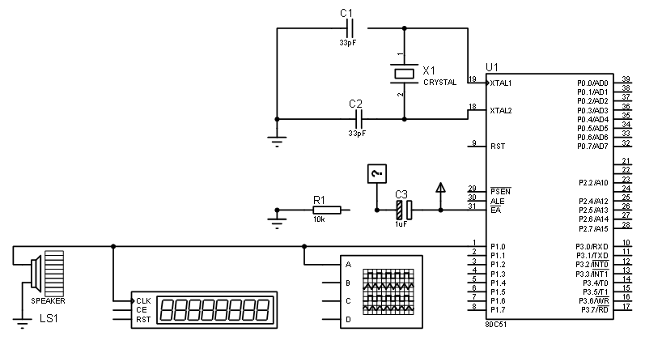

# Trabalho-Microprocessadores
Trabalho realizado para a disciplina de Microprocessadores.

Consiste em programar microcontroladores em Assembly para codificar e temporizar as notas de uma música.

Esquemático do Circuito com 8051:

Vídeo mostrando Funcionamento:
<iframe width="560" height="315" src="https://www.youtube.com/embed/YLzT9UFdLBE" title="YouTube video player" frameborder="0" allow="accelerometer; autoplay; clipboard-write; encrypted-media; gyroscope; picture-in-picture" allowfullscreen></iframe>
