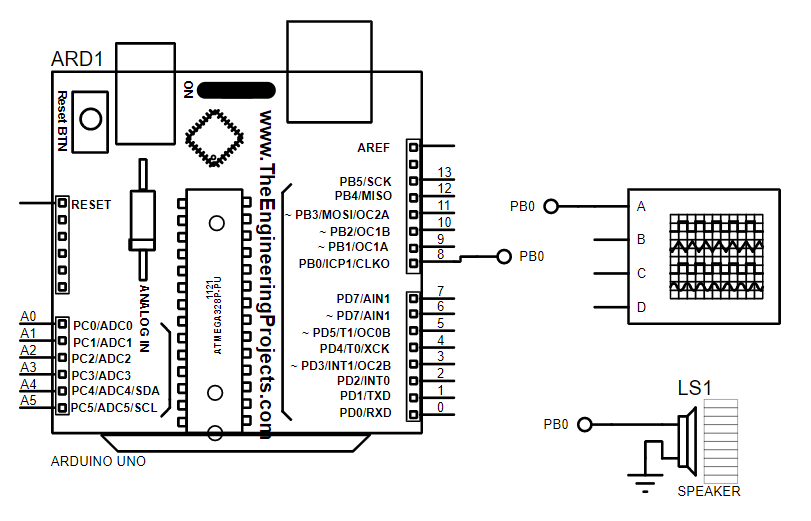

# Trabalho-Microprocessadores
Trabalho realizado para a disciplina de Microprocessadores.

Consiste em programar microcontroladores em Assembly para codificar e temporizar as notas de uma música.

Arquivo "main.asm" contém o código para Arduino, enquanto o" playingV5.asm" contém o código para o 8051.

Esquemático do Circuito com 8051:

Vídeo mostrando Funcionamento:
https://www.youtube.com/watch?v=YLzT9UFdLBE

Esquemático do Circuito com Arduino:

